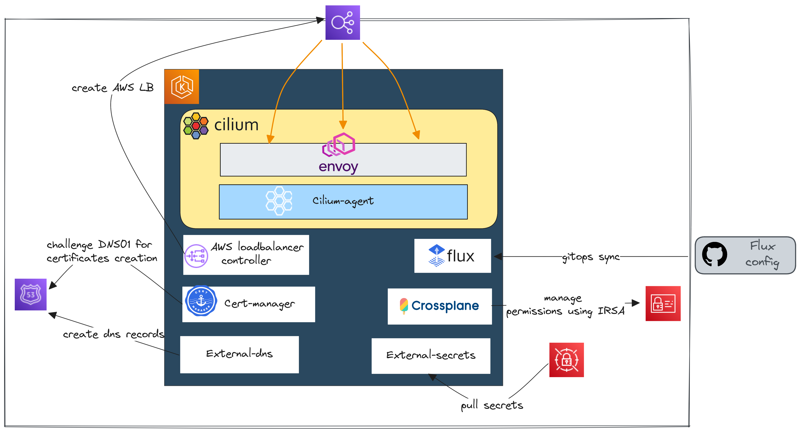

# cilium-gateway-api

⚠️ **Work in progress** for a future blog post [here](https://blog.ogenki.io/)

The main purpose of this repository is to demonstrate how [**Cilium**](https://cilium.io/) implements the [**Gateway-API**](https://gateway-api.sigs.k8s.io/) standard.

This repository also is a reference for configuring a platform with the following key components:

* An EKS cluster deployed using Terraform ([here](./terraform/eks/README.md) for details)
* Cilium is installed as the dropin replacement of the AWS CNI in kube-proxy less mode AND using a distinct daemonSet for Envoy (L7 loadbalancing)
* Everything is deployed the GitOps way using Flux
* Crossplane is used to configure IAM permissions required by the platform components
* Manage DNS records automatically using External-DNS
* Manage secrets from AWS secrets manager using External-Secrets

## Dependencies matter

```mermaid
graph TD;
    Namespaces-->CRDs;
    CRDs-->Observability;
    CRDs-->Security;
    CRDs-->Infrastructure;
    Crossplane-->Infrastructure;
    Crossplane-->Security;
    Observability-->Apps;
    Infrastructure-->Apps;
    Security-->Apps;
    Security-->Observability;
    Security-->Infrastructure
```

This diagram can be hard to understand so these are the key information:

* **Namespaces** are the first resources to be created, all other resources may be namespace scoped
* **CRDs** that allow to extend Kubernetes capabilities must be present in order to use them in all other applications when needed.
* **Crossplane** creates [IRSA](https://docs.aws.amazon.com/emr/latest/EMR-on-EKS-DevelopmentGuide/setting-up-enable-IAM.html) permissions which are required by some components
* **Security** defines `external-secrets` that are needed by some applications in order to start. Furthermore there may be `kyverno` mutating policies that must be there before the resources they are targeting.
